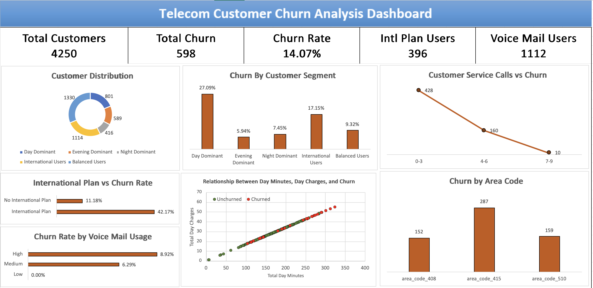

# Telecom Customer Churn Analysis Dashboard

## Overview

This project analyzes customer churn behavior in a telecom company using **Microsoft Excel**. The objective is to identify key factors influencing customer churn and present insights through a **visual dashboard**.

Customer churn is a major challenge for telecom companies, as losing customers directly affects revenue. This analysis focuses on understanding how service usage, plan subscriptions, and customer behavior relate to churn.

---

## Objectives

* Identify patterns and factors associated with customer churn
* Segment customers based on service usage behavior
* Compare churn rates across different customer groups
* Build a clear and informative **Excel dashboard** to visualize insights

---

## Dataset

The dataset contains customer-level telecom usage information including:

* Account length
* International plan subscription
* Voice mail plan
* Total day, evening, and night usage
* International call usage
* Customer service call frequency
* Churn status (Yes/No)

These variables were analyzed to determine which factors are associated with higher churn rates.

---

## Analysis Performed

The following analyses were conducted:

### Customer Segmentation

Customers were segmented based on usage patterns:

* Day Dominant Users
* Evening Dominant Users
* Night Dominant Users
* International Users
* Balanced Users

### Plan-Based Churn Analysis

Churn rates were compared for:

* Customers with and without **International Plans**
* Customers with different levels of **Voice Mail Usage**

### Service Interaction Analysis

Customer churn was analyzed based on the number of **Customer Service Calls**, revealing behavioral indicators of dissatisfaction.

### Usage Relationship Analysis

A **scatter plot** was created to visualize the relationship between **Total Day Minutes and Total Day Charges**, highlighting usage behavior patterns.

---

## Dashboard Features

The Excel dashboard presents insights using:

* KPI cards showing key metrics
* Churn comparison charts
* Customer segment analysis
* Plan subscription impact on churn
* Usage pattern visualizations

The dashboard allows quick identification of **high-risk customer groups**.

---

## Key Insights

Key findings from the analysis include:

* Customers with **International Plans show significantly higher churn rates** compared to those without.
* **Day Dominant users have the highest churn rate among usage segments.**
* Customers with **higher customer service call frequency are more likely to churn.**
* **Voice mail users generally show lower churn rates**, suggesting better engagement or satisfaction.

---

## Dashboard Preview



---

## Tools Used

* Microsoft Excel
* Excel Charts and Visualization
* Data Segmentation Techniques
* Basic Statistical Analysis

---

## Project Structure

```
telecom-customer-churn-analysis-dashboard
│
├──  telecom_churn_dataset.xlsx
│
├── churn_dashboard.xlsx
│
├── dashboard.png
│
├── telecom_churn_dataset.pdf
│
└── README.md
```

---

## Author

**Bhargav Kumar**
